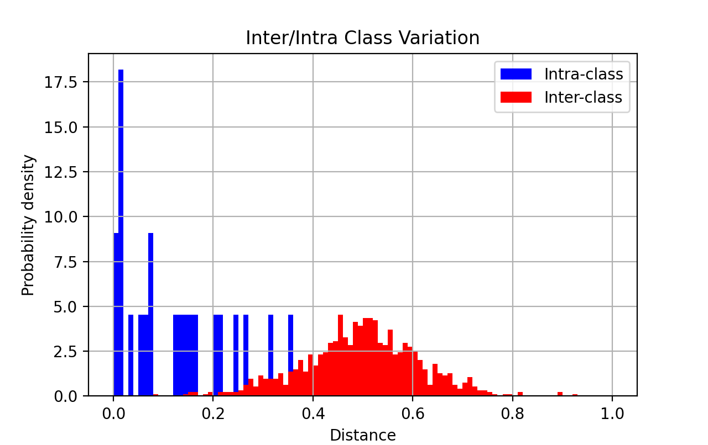
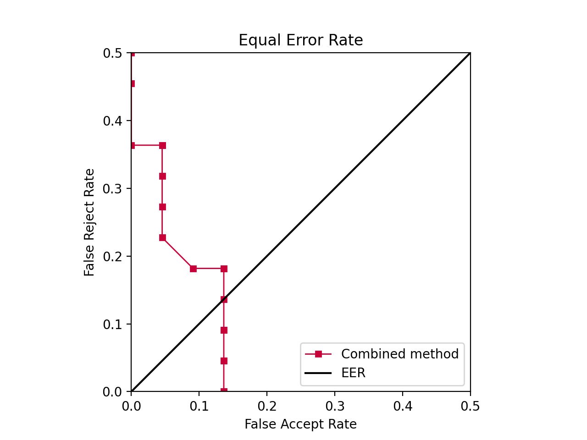
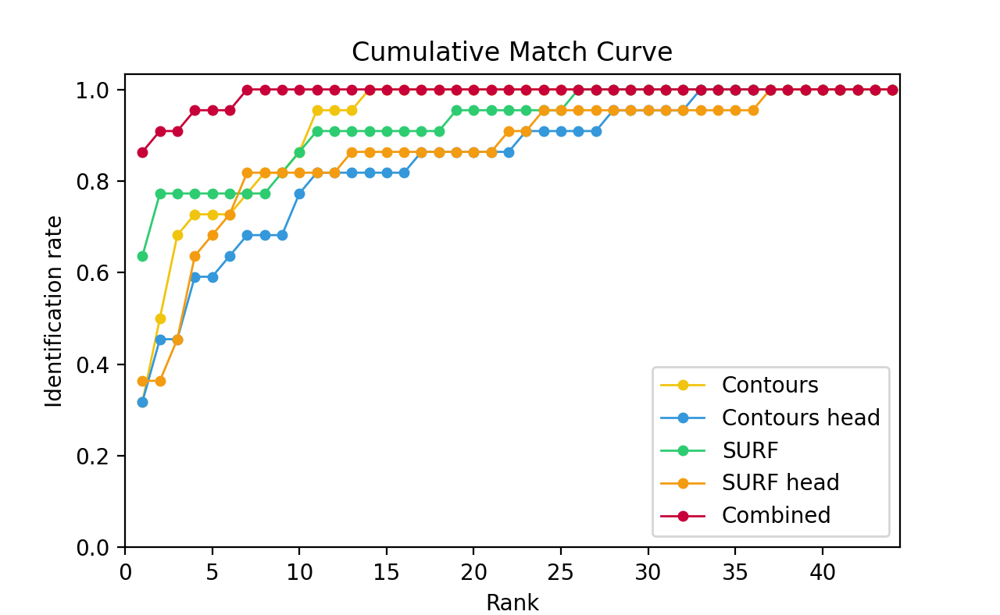

# COMP 6211: Biometrics coursework

Project of biometric classification system, which is able to  recognize people by their body shape. Four feature extraction techniques are used. Project was build with Python 3 and OpenCV 4.1.1.

## Structure
- `/datasets` contains original image datasets with labeled images
- `/preprocessed` contains generated images from pre-proccess stage
- `/templates` contains image templates for template matching
- `/plots` contains generated plots

## Installation
Use package manager `pip` to install dependencies
```shell script
pip3 install -r requirements.txt
```

## Usage

### Pre-processing
Run preprocess.py script:
```shell script
python3 preprocess.py
```
This script will preprocess images from `/datasets` and save them to `/preprocessed`.

Three different image types will be created:
 1. `body` - grayscale bodyimages
 2. `masked_body` - masked images of body shape
 3. `masked_head` - masked images of head shape
 
### Classification
Run model.py script for classification:
```shell script
python3 model.py
```
Classification will print accuracies for individual classifiers and combined accuracy. Three plots are created.

Inter/Intra class variation (combined results)


Equal Error Rate (combined results)


Cummulative Match Curve (all classifiers)


